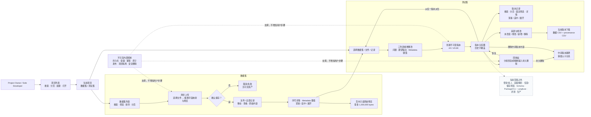
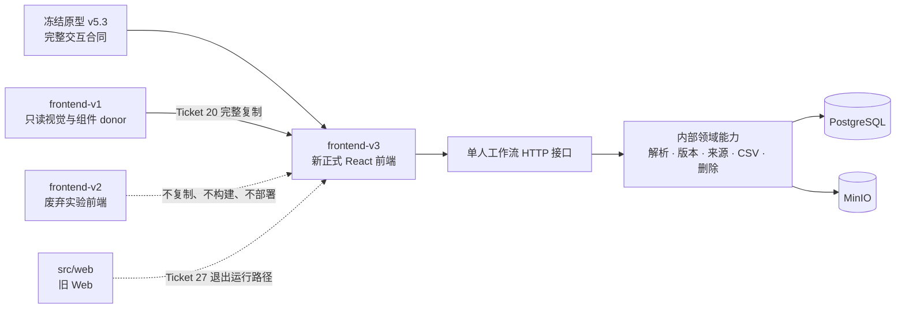
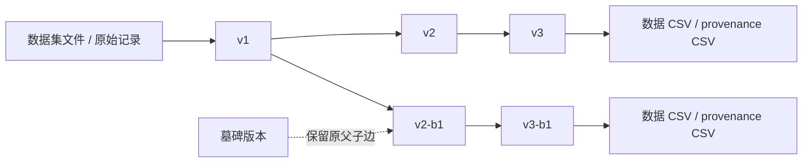

# EvalBase 系统流程图

本图以 `92cb8a5` / `prototype/solo-workflow-v5.3` 为完整用户交互合同。正式产品只实现图中的可见动作；内部机制不得增加页面或步骤。

静态图：[PNG](./system-flow-v2.png)；Mermaid 源文件：[MMD](./system-flow-v2.mmd)。

## 1. 单人主流程

### 读图重点

- 应用无登录，首屏是项目列表；进入项目后只有数据集和测试集两个子入口。
- “数据集”是原始文件容器，不是测试集。上传只有选择文件、拖拽字段映射与预览两步；Metadata 保留字段和值的边界。
- 记录通过序号打开详情。单文件原始内容只在当前页只读预览开头最多 1,000,000 bytes，并在截断时明确提示。
- 用户从真实记录创建 `v1`，后续从任一历史版本派生；任何版本都不覆盖。
- 版本记录以服务端搜索、分页和固定筛选浏览；多个筛选条件同时满足，多选来源文件在来源条件内匹配任一项。
- 来源页只解释直接父版本、新加入资料和逐条增删改。
- 下载是当前版本数据 CSV，以及数据 CSV + provenance CSV 两个独立文件。
- 测试集列表的垃圾桶只回收整套测试集；回收站按测试集和版本分组，恢复整套测试集会恢复其已吸收版本，永久删除与墓碑须精确输入名称或版本号。
- 持久化、容量、幂等、项目隔离和安全删除是不可见机制。

## 2. 前端与后端职责

`frontend-v1/` 永久保持不变。`frontend-v3/` 直接继承 donor 的字体、布局、样式和组件，再按冻结原型连接真实 API。`frontend-v2/` 保留 Git 历史但不再作为开发、预览、构建、部署或回滚目标。

## 3. 版本与来源

版本图只表达版本父子关系；逐条来源仍指向数据集、文件、原始记录、父修订或手工新增事实。所有浏览和下载都绑定当前选中版本。
